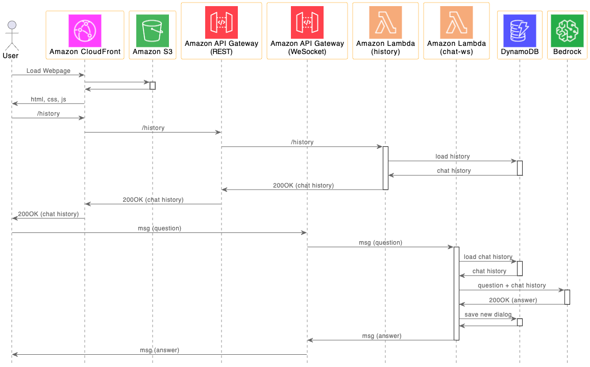

# Amazon Bedrock을 이용하여 Stream 방식의 한국어 Chatbot 구현하기 

LLM (Large Language Model)을 이용하면 기존 Rule 방식의 Chatbot보다 훨씬 우수한 대화를 할 수 있습니다. Chatbot과 원활한 대화를 위해서는 사용자의 질문(Question)에 대한 답변(Answer)을 얻을 때까지 기다리기 보다는 [Stream 형태](https://blog.langchain.dev/streaming-support-in-langchain/)로 대화하듯이 보여주는것이 사용성에서 좋습니다. 본 게시글에서는 [LangChain](https://www.langchain.com/)을 사용하여 Stream을 지원하는 한국어 chatbot을 만드는 방법을 설명합니다. 

Stream 방식은 하나의 요청에 여러번의 응답을 얻게 되므로, HTTP 방식보다는 세션을 통해 메시지를 교환하는 WebSocket 방식이 유용합니다. 또한 서버리스(serverless) 아키텍처를 사용하면 인프라의 유지보수에 대한 부담없이 인프라를 효율적으로 관리할 수 있습니다. 여기서는 서버리스인 [Amazon API Gateway를 이용해 Client와 WebSocket을 연결](https://docs.aws.amazon.com/ko_kr/apigateway/latest/developerguide/apigateway-WebSocket-api-overview.html)하고 [AWS Lambda](https://aws.amazon.com/ko/pm/lambda/?nc1=h_ls)를 이용하여 세션을 관리합니다. 본 게시글에서 사용하는 Client는 Web으로 제공되고, 채팅 이력은 로컬 디바이스가 아니라 서버에 저장되게 됩니다. [Amazon DynamoDB](https://aws.amazon.com/ko/dynamodb/)는 Json형태로 채팅 이력을 저장하는데 유용합니다. 이와같이 Client에서는 로그인시에 DynamoDB에 저장된 채팅 이력을 로드하여 보여줍니다. 또한 채팅 이력은 LLM에 질문 할때에도 문맥(context)을 파악하기 위하여 유용하게 사용되므로, 사용자 아이디를 이용하여 DynamoDB에서 채팅 이력을 로드하여 로컬 메모리에 저장하여 활용합니다. 


## Architecture 개요

전체적인 Architecture는 아래와 같습니다. 사용자가 Web Client를 이용하여 로그인하면, DynamoDB에서 이전 대화 이력을 로드하여 채팅 화면에서 확인할 수 있습니다. 이후 질문을 입력하면 WebSocket을 이용하여 API Gateway를 거쳐 Lambda로 질문이 전달됩니다. Lambda는 DynamoDB에서 채팅이력을 확인하여 채팅을 위한 메모리를 할당합니다. 이후 질문과 채팅이력을 포함한 메시지를 Amazon Bedrock에 전달하여 질문에 대한 답변을 요청합니다. 이때 Bedrock의 Anthropic Claude 모델이 답변을 생성하면, Lambda와 API Gateway를 거쳐사 사용자에게 전달되게 됩니다. 전체 인프라는 [AWS CDK](https://aws.amazon.com/ko/cdk/)를 이용해 쉽게 배포되고 관리할 수 있습니다.


상세하게 단계별로 설명하면 아래와 같습니다. 

- 단계1: 브라우저를 이용하여 사용자가 CloudFront 주소로 접속하면, Amazon S3에서 HTML, CSS, JS등의 파일을 전달합니다. 이때 로그인을 수행하고 채팅 화면으로 진입합니다.

- 단계2: [Client](./html/chat.js)는 사용자 아이디를 이용하여 '/history' API로 채팅이력을 요청합니다. 이 요청은 API Gateway를 거쳐서 [lambda-history](./lambda-gethistory/index.js)에 전달됩니다. 이후 DynamoDB에서 채팅 이력을 조회한 후에 다시 API Gateway와 [lambda-history](./lambda-gethistory/index.js)를 통해 사용자에게 전달합니다.

- 단계3: Client가 API Gateway로 WebSocket 연결을 시도하면, API Gateway를 거쳐서 [lambda-chat-ws](./lambda-chat-ws/lambda_function.py)로 WebSocket connection event가 전달됩니다. 이후 사용자가 메시지를 입력하면, API Gateway를 거쳐서 [lambda-chat-ws](./lambda-chat-ws/lambda_function.py)로 메시지가 전달됩니다.
  
- 단계4: [lambda-chat-ws](./lambda-chat-ws/lambda_function.py)은 사용자 아이디를 이용하여 DynamoDB의 기존 채팅이력을 읽어와서, 채팅 메모리에 저장합니다.

- 단계5: [lambda-chat-ws](./lambda-chat-ws/lambda_function.py)은 사용자의 질문(question)과 채팅 이력(chat history)을 Amazon Bedrock의 Enpoint로 전달합니다. 

- 단계6: Amazon Bedrock의 사용자의 질문과 채팅이력이 전달되면, Anthropic LLM을 이용하여 적절한 답변(answer)을 사용자에게 전달합니다. 이때, stream을 사용하여 답변이 완성되기 전에 답변(answer)를 사용자에게 보여줄 수 있습니다.

이때의 Sequence diagram은 아래와 같습니다.




## 주요 시스템 구성

전체 시스템의 상세 구현에 대하여 아래와 같이 설명합니다.

### 서버리스 기반으로 WebSocket 연결하기

[Client](./html/chat.js)는 서버리스인 API Gateway를 이용하여 [WebSocket과 연결](https://docs.aws.amazon.com/ko_kr/apigateway/latest/developerguide/apigateway-WebSocket-api-overview.html)합니다. 이때 client가 연결하는 endpoint는 API Gateway 주소입니다. 아래와 같이 WebSocket을 선언한 후에 onmessage로 메시지가 들어오면, event의 'data'에서 메시지를 추출합니다. 세션을 유지하기 위해 일정간격으로 keep alive 동작을 수행합니다. 

```java
const ws = new WebSocket(endpoint);

ws.onmessage = function (event) {        
    response = JSON.parse(event.data)

    if(response.request_id) {
        addReceivedMessage(response.request_id, response.msg);
    }
};

ws.onopen = function () {
    isConnected = true;
    if(type == 'initial')
        setInterval(ping, 57000); 
};

ws.onclose = function () {
    isConnected = false;
    ws.close();
};
```

발신 메시지는 JSON 포맷으로 아래와 같이 userId, 요청시간, 메시지 타입과 메시지를 포함합니다. 발신시 [WebSocket의 send()](https://developer.mozilla.org/en-US/docs/Web/API/WebSocket/send)을 이용하여 아래와 같이 발신합니다. 만약 발신시점에 세션이 연결되어 있지 않다면 연결하고 재시도하도록 알림을 표시합니다.

```java
sendMessage({
    "user_id": userId,
    "request_id": requestId,
    "request_time": requestTime,        
    "type": "text",
    "body": message.value
})

WebSocket = connect(endpoint, 'initial');
function sendMessage(message) {
    if(!isConnected) {
        WebSocket = connect(endpoint, 'reconnect');
        
        addNotifyMessage("재연결중입니다. 잠시후 다시시도하세요.");
    }
    else {
        WebSocket.send(JSON.stringify(message));     
    }     
}
```

### Stream 사용하기

[lambda-chat-ws](./lambda-chat-ws/lambda_function.py)에서는 Bedrock을 사용하기 위하여 아래와 같이 [Boto3로 Bedrock client](https://boto3.amazonaws.com/v1/documentation/api/latest/reference/services/bedrock.html)를 정의합니다. 여기서는 chatbot과 관련된 인프라는 서울 리전을 사용하고, Bedrock은 N.Virginia (us-east-1)을 사용합니다.

```python
import boto3

boto3_bedrock = boto3.client(
    service_name='bedrock-runtime',
    region_name=bedrock_region,
    config=Config(
        retries = {
            'max_attempts': 30
        }            
    )
)
```

아래와 같이 LLM에서 어플리케이션을 편리하게 만드는 프레임워크인 [LangChain](https://docs.langchain.com/docs/)을 사용하여 [Bedrock Chat](https://python.langchain.com/docs/integrations/chat/bedrock)을 정의합니다. 이때 stream으로 출력을 보여줄 수 있도록 streaming을 True로 설정합니다. 또한 [StreamingStdOutCallbackHandler](https://api.python.langchain.com/en/latest/callbacks/langchain.callbacks.streaming_stdout.StreamingStdOutCallbackHandler.html)을 callback으로 등록합니다.

```python
from langchain_community.chat_models import BedrockChat
from langchain.callbacks.streaming_stdout import StreamingStdOutCallbackHandler

chat = BedrockChat(
    model_id=modelId,
    client=boto3_bedrock, 
    streaming=True,
    callbacks=[StreamingStdOutCallbackHandler()],
    model_kwargs=parameters,
)  
```

사용자가 WebSocket을 이용하여 API Gateway로 보낸 메시지가 [lambda-chat-ws](https://github.com/kyopark2014/stream-chatbot-for-amazon-bedrock/blob/main/lambda-chat-ws/lambda_function.py)에 전달되면, 아래와 같이 event에서 connectionId와 routeKey를 추출할 수 있습니다. routeKey가 "default"일때 사용자게 보낸 메시지가 들어오는데 여기서 'body"를 추출하여, json포맷의 데이터에서 사용자의 입력인 'text'를 추출합니다. 이후 아래와 같이 conversation.predict()을 이용하여 LLM에 답변을 요청합니다. 

```python
def general_conversation(connectionId, requestId, chat, query):
    global time_for_inference, history_length, token_counter_history    
    time_for_inference = history_length = token_counter_history = 0
    
    if isKorean(query)==True :
        system = (
            "다음의 Human과 Assistant의 친근한 이전 대화입니다. Assistant은 상황에 맞는 구체적인 세부 정보를 충분히 제공합니다. Assistant의 이름은 서연이고, 모르는 질문을 받으면 솔직히 모른다고 말합니다."
        )
    else: 
        system = (
            "Using the following conversation, answer friendly for the newest question. If you don't know the answer, just say that you don't know, don't try to make up an answer. You will be acting as a thoughtful advisor."
        )
    
    human = "{input}"
    
    prompt = ChatPromptTemplate.from_messages([("system", system), MessagesPlaceholder(variable_name="history"), ("human", human)])
    print('prompt: ', prompt)
    
    history = memory_chain.load_memory_variables({})["chat_history"]
    print('memory_chain: ', history)
                
    chain = prompt | chat    
    try: 
        isTyping(connectionId, requestId)  
        stream = chain.invoke(
            {
                "history": history,
                "input": query,
            }
        )
        msg = readStreamMsg(connectionId, requestId, stream.content)    
                            
        msg = stream.content
        print('msg: ', msg)
    except Exception:
        err_msg = traceback.format_exc()
        print('error message: ', err_msg)        
            
        sendErrorMessage(connectionId, requestId, err_msg)    
        raise Exception ("Not able to request to LLM")
    
    memory_chain.chat_memory.add_user_message(query)
    memory_chain.chat_memory.add_ai_message(msg)
    
    return msg
```

LLM의 답변은 stream으로 들어오는데, 아래와 같이 stream에서 event를 추출한 후에 sendMessage() 이용하여 client로 답변을 전달합니다. 또한, client에서 답변 메시지를 구분하여 표시하기 위해서, "request_id"를 함께 전달합니다.  

```python
def readStreamMsg(connectionId, requestId, stream):
    msg = ""
    if stream:
        for event in stream:
            msg = msg + event

            result = {
                'request_id': requestId,
                'msg': msg,
                'status': 'proceeding'
            }
            sendMessage(connectionId, result)
    return msg
```

아래와 같이 sendMessage()는 [Boto3의 post_to_connection](https://boto3.amazonaws.com/v1/documentation/api/latest/reference/services/apigatewaymanagementapi/client/post_to_connection.html)을 이용하여 client로 응답을 전송 합니다. 이때 lambda-chat-ws가 메시지를 전달하는 Endpoint는 WebSocket을 지원하는 API Gateway 주소입니다.

```python
import boto3
client = boto3.client('apigatewaymanagementapi', endpoint_url=connection_url)

def sendMessage(id, body):
    try:
        client.post_to_connection(
            ConnectionId=id, 
            Data=json.dumps(body)
        )
    except Exception:
        err_msg = traceback.format_exc()
        print('err_msg: ', err_msg)
        raise Exception ("Not able to send a message")
```

### 대화 이력의 관리

[Client](./html/chat.js)는 이전 채팅 이력을 가져오기 위하여 '/history' API와 연결된 [lambda-gethistory](./lambda-gethistory/index.js)로 아래와 같이 사용자 아이디(userId)와 얻어올 시간(allowTime)을 포함한 요청을 전달합니다. 이에 대한 전달받은 history를 풀어서 채팅창에 표시합니다. 

```javascript
getHistory(userId, allowTime);

function getHistory(userId, allowTime) {
    const uri = "history";
    const xhr = new XMLHttpRequest();

    xhr.open("POST", uri, true);
    xhr.onreadystatechange = () => {
        if (xhr.readyState === 4 && xhr.status === 200) {
            let response = JSON.parse(xhr.responseText);
            let history = JSON.parse(response['msg']);
                        
            for(let i=0; i<history.length; i++) {
                if(history[i].type=='text') {                
                    let requestId = history[i].request_id;
                    let timestr = history[i].request_time;
                    let body = history[i].body;
                    let msg = history[i].msg;

                    addSentMessage(requestId, timestr, body)
                    addReceivedMessage(requestId, msg);                            
                }                 
            }         
        }
    };
    
    var requestObj = {
        "userId": userId,
        "allowTime": allowTime
    }
    var blob = new Blob([JSON.stringify(requestObj)], {type: 'application/json'});

    xhr.send(blob);            
}
```

[lambda-gethistory](./lambda-gethistory/index.js)은 아래와 같이 userId와 allowTime을 이용하여 DynamoDB를 부터 채팅 이력을 query하여, 결과를 client로 전달합니다.

```java
const aws = require('aws-sdk');
var dynamo = new aws.DynamoDB();

let queryParams = {
    TableName: tableName,
    KeyConditionExpression: "user_id = :userId and request_time > :allowTime",
    ExpressionAttributeValues: {
        ":userId": {'S': userId},
        ":allowTime": {'S': allowTime}
    }
};

try {
    let result = await dynamo.query(queryParams).promise();

    let history = [];
    for(let item of result['Items']) {
        console.log('item: ', item);
        let request_time = item['request_time']['S'];
        let request_id = item['request_id']['S'];
        let body = item['body']['S'];
        let msg = item['msg']['S'];
        let type = item['type']['S'];

        history.push({
            'request_time': request_time,
            'request_id': request_id,
            'type': type,
            'body': body,
            'msg': msg,
        });
    }

    const response = {
        statusCode: 200,
        msg: JSON.stringify(history)
    };
    return response;        
}
```

채팅 이력은 [ConversationBufferWindowMemory](https://python.langchain.com/docs/modules/memory/types/buffer_window)을 이용하여 memory_chain으로 저장합니다. Lambda가 시작할때 map_chain에 접속한 사용자(userId)에 대한 대화 이력이 있는지 확인합니다. 없다면 DynamoDB에 저장된 데이터를 로드합니다. 여기서는 모든 대화 이력을 읽어들이지 않고 일정시간 이후(allowTime)의 대화 이력을 가져옵니다.

```python
from langchain.memory import ConversationBufferWindowMemory

map_chain = dict()

# create memory
if userId in map_chain:  
    print('memory exist. reuse it!')        
    memory_chain = map_chain[userId]
else: 
    print('memory does not exist. create new one!')        
    memory_chain = ConversationBufferWindowMemory(memory_key="chat_history", output_key='answer', return_messages=True, k=10)
    map_chain[userId] = memory_chain

    allowTime = getAllowTime()
    load_chat_history(userId, allowTime)

def load_chat_history(userId, allowTime):
    dynamodb_client = boto3.client('dynamodb')

    response = dynamodb_client.query(
        TableName=callLogTableName,
        KeyConditionExpression='user_id = :userId AND request_time > :allowTime',
        ExpressionAttributeValues={
            ':userId': {'S': userId},
            ':allowTime': {'S': allowTime}
        }
    )
    # print('query result: ', response['Items'])

    for item in response['Items']:
        text = item['body']['S']
        msg = item['msg']['S']
        type = item['type']['S']

        if type == 'text':
            memory_chain.chat_memory.add_user_message(text)
            if len(msg) > MSG_LENGTH:
                memory_chain.chat_memory.add_ai_message(msg[:MSG_LENGTH])                          
            else:
                memory_chain.chat_memory.add_ai_message(msg)     
```

새로운 Dialog가 추가 되면 아래와 같이 memory_chain에 수신 메시지(query)와 답변(msg)을 저장합니다.

```python
memory_chain.chat_memory.add_user_message(query)
memory_chain.chat_memory.add_ai_message(msg)
```

### WebSocket을 지원하는 API Gateway를 구현하기

[cdk-stream-chatbot-stack.ts](./cdk-stream-chatbot/lib/cdk-stream-chatbot-stack.ts)에서는 아래와 같이 WebSocket을 지원하는 API Gateway를 정의합니다. 여기서 [client](./html/chat.js)가 접속하는 API Gateway의 Endpoint는 wss_url이고, [lambda-chat-ws](./lambda-chat-ws/lambda_function.py)가 접속하는 API Gateway의 endpoint는 connection_url입니다.

```typescript
const WebSocketapi = new apigatewayv2.CfnApi(this, `ws-api-for-${projectName}`, {
    description: 'API Gateway for chatbot using WebSocket',
    apiKeySelectionExpression: "$request.header.x-api-key",
    name: 'ws-api-for-' + projectName,
    protocolType: "WebSocket", 
    routeSelectionExpression: "$request.body.action",
});
const wss_url = `wss://${WebSocketapi.attrApiId}.execute-api.${region}.amazonaws.com/${stage}`;
const connection_url = `https://${WebSocketapi.attrApiId}.execute-api.${region}.amazonaws.com/${stage}`;
```

## Prompt Engineering

### 번역하기

ChatPromptTemplate을 이용하여 번역시 입력/출력 언어를 지정합니다. 번역된 결과만을 얻기 위하여 <result> tag를 요청하고 결과에서는 해당 tag를 제거합니다.

```python
def translate_text(chat, text):
    system = (
        "You are a helpful assistant that translates {input_language} to {output_language} in <article> tags. Put it in <result> tags."
    )
    human = "<article>{text}</article>"
    
    prompt = ChatPromptTemplate.from_messages([("system", system), ("human", human)])
    
    if isKorean(text)==False :
        input_language = "English"
        output_language = "Korean"
    else:
        input_language = "Korean"
        output_language = "English"
                        
    chain = prompt | chat    
    try: 
        result = chain.invoke(
            {
                "input_language": input_language,
                "output_language": output_language,
                "text": text,
            }
        )
        msg = result.content
    except Exception:
        err_msg = traceback.format_exc()
        print('error message: ', err_msg)                    
        raise Exception ("Not able to request to LLM")

    return msg[msg.find('<result>')+8:len(msg)-9] # remove <result> tag
```


## 직접 실습 해보기

### 사전 준비 사항

이 솔루션을 사용하기 위해서는 사전에 아래와 같은 준비가 되어야 합니다.

- [AWS Account 생성](https://repost.aws/ko/knowledge-center/create-and-activate-aws-account)

### CDK를 이용한 인프라 설치

[deployment.md](./deployment.md)에 따라 인프라를 설치합니다.

### 실행결과

#### 일반적인 대화

"서울을 여행하고 싶어. 무엇을 타고 여행하는것이 좋을까?"라고 입력하면 서울의 정보를 알려줍니다.


대명사를 이용해 "그럼 그 도시에서 지하철 요금은 얼마야?"로 문의하면 아래와 같이 서울 지하철 요금을 알려줍니다. 2023년 10월에 지하철 요금이 150원이 올라서 1400원(교통카드 기준)이므로 최신 정보를 반영하고 못하고 있지만, 대화 이력을 통해 서울의 지하철 요금을 확인할 수 있었습니다.


'서울'과 '지하철'이라는 단어를 넣지 않고 "그럼 환승도 가능해?"로 물었을때 아래와 같이 이전 대화 이력(chat history)을 이용하여 서울 지하철의 환승에 대해 설명하여 줍니다.


#### 번역하기 

"아마존 베드락을 이용해 주셔서 감사합니다. 편안한 대화를 즐기실 수 있으며, 파일을 업로드하시면 요약해 드릴 수 있습니다."로 입력하면 아래와 같은 변억 결과를 얻을 수 있습니다.


#### 문법 확인하기

"Thank you using Amazon Bedrock. You can enjoy aa comfortable convarsation, and if you upload a file, I can summarize it for you."을 넣으면 아래와 같이 잘못된 부분을 알려주고 수정하여 줍니다.


#### Extracted Topic and sentiment

“식사 가성비 좋습니다. 위치가 좋고 스카이라운지 바베큐 / 야경 최곱니다. 아쉬웠던 점 · 지하주차장이 비좁습니다.. 호텔앞 교통이 너무 복잡해서 주변시설을 이용하기 어렵습니다. / 한강나가는 길 / 주변시설에 나가는 방법등.. 필요합니다.”를 입력하고 결과를 확인합니다.


#### Information extraction

“John Park. Solutions Architect | WWCS Amazon Web Services Email: john@amazon.com Mobile: +82-10-1234-5555“로 입력후에 이메일이 추출되는지 확인합니다.

#### PII(personally identifiable information) 삭제하기

PII(Personal Identification Information)의 삭제의 예는 아래와 같습니다. "John Park, Ph.D. Solutions Architect | WWCS Amazon Web Services Email: john@amazon.com Mobile: +82-10-1234-4567"와 같이 입력하여 name, phone number, address를 삭제한 텍스트를 얻습니다. 프롬프트는 PII를 참조합니다.

#### 복잡한 질문 (step-by-step)

"I have two pet cats. One of them is missing a leg. The other one has a normal number of legs for a cat to have. In total, how many legs do my cats have?"를 입력하고 결과를 확인합니다.

#### 날짜/시간 추출하기

메뉴에서 "Timestamp Extraction"을 선택하고, "지금은 2023년 12월 5일 18시 26분이야"라고 입력하면 prompt를 이용해 아래처럼 시간을 추출합니다.


## 리소스 정리하기 

더이상 인프라를 사용하지 않는 경우에 아래처럼 모든 리소스를 삭제할 수 있습니다. 

1) [API Gateway Console](https://ap-northeast-2.console.aws.amazon.com/apigateway/main/apis?region=ap-northeast-2)로 접속하여 "rest-api-for-stream-chatbot", "ws-api-for-stream-chatbot"을 삭제합니다.

2) [Cloud9 console](https://ap-northeast-2.console.aws.amazon.com/cloud9control/home?region=ap-northeast-2#/)에 접속하여 아래의 명령어로 전체 삭제를 합니다.


```text
cdk destroy --all
```

## 결론

Amazon Bedrock의 상용으로 AWS 환경에서 한국어 chatbot을 쉽게 구현할 수 있게 되었습니다. 본 게시글에서는 Anthropic의 Claude LLM과 대표적인 LLM 어플리케이션 개발 프레임워크인 LangChain을 이용하여 한국어 chatbot을 만들었습니다. 이때 WebSocket을 이용하여 client와 서버를 연결하였고, stream 형태로 답변을 표시할 수 있었습니다. Amazon Bedrock은 다양한 Foundation Model로 쉽게 생성형 AI 어플리케이션을 개발할 수 있도록 도와줍니다. 또한 한국어 chatbot을 위한 인프라는 서버리스로 구성해서 인프라 관리에 대한 부담을 줄였고, AWS CDK를 이용하여 인프라의 배포 및 관리를 쉽게할 수 있도록 하였습니다. 대용량 언어 모델을 이용한 한국어 chatbot은 기존 rule 방식과 비교하여, 훨씬 개선된 대화 능력을 보여줍니다. 향후 Amazon Bedrock을 이용하여 다양한 어플리케이션을 쉽고 효과적으로 개발할 수 있을것으로 기대됩니다. 

## 실습 코드 및 도움이 되는 참조 블로그

아래의 링크에서 실습 소스 파일 및 기계 학습(ML)과 관련된 자료를 확인하실 수 있습니다.

- [Amazon SageMaker JumpStart를 이용하여 Falcon Foundation Model기반의 Chatbot 만들기](https://aws.amazon.com/ko/blogs/tech/chatbot-based-on-falcon-fm/)
- [Amazon SageMaker JumpStart와 Vector Store를 이용하여 Llama 2로 Chatbot 만들기](https://aws.amazon.com/ko/blogs/tech/sagemaker-jumpstart-vector-store-llama2-chatbot/)
- [VARCO LLM과 Amazon OpenSearch를 이용하여 한국어 Chatbot 만들기](https://aws.amazon.com/ko/blogs/tech/korean-chatbot-using-varco-llm-and-opensearch/)

